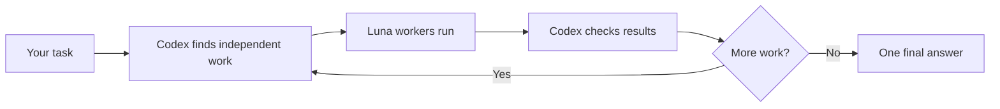

# Luna Agent

Use native GPT-5.6 Luna workers inside Codex. Codex delegates independent work, checks the results,
and returns one answer. The project uses your Codex login. It needs no API key, MCP server, Docker
container, or background service.

## What you need

- Codex CLI with access to `gpt-5.6-luna`
- A ChatGPT account signed in through Codex
- PowerShell on Windows, or a terminal on macOS/Linux

## Install

From this repository, run one command.

Windows PowerShell:

```powershell
./scripts/install.ps1
```

macOS or Linux:

```bash
./scripts/install.sh
```

Restart Codex or open a new conversation when the installer finishes.

The installer adds the `luna` profile, five Luna presets, and the global Skill. It does not edit
`~/.codex/config.toml`. In Codex, the project and Skill appear as **Luna Agent**.

## Use

Start Codex in the project you want to work on:

```bash
codex -p luna
```

For a complex task with independent workstreams, Codex can invoke Luna Agent automatically. It
does not trigger for simple or sequential tasks, incidental model discussion, setup questions, or
when you ask Codex not to use agents.

To invoke it directly, use the Skill name `$luna-agent`:

```text
Use $luna-agent with agents=auto and effort=max.
Delegate the independent parts of this task, then give me one summary.
```

Defaults are `effort=max` and `agents=auto`. You can choose `low`, `medium`, `high`, or `xhigh`, and
set `agents` from `1` to `4`. The agent count is the limit for one wave. Workers inherit the parent
session's context, tools, permissions, approvals, configuration, and service tier.



## Settings

| Setting | Values | Default |
| --- | --- | --- |
| Reasoning | `low`, `medium`, `high`, `xhigh`, `max` | `max` |
| Agents per wave | `auto`, `1` to `4` | `auto` |

## Check and upgrade

Run the local check:

Windows:

```powershell
./scripts/check.ps1
```

macOS or Linux:

```bash
./scripts/check.sh
```

The check reads Codex's local model catalog and does not send a model request. If it fails, run
`codex login status`, update Codex if Luna or an effort is missing, and restart Codex.

When upgrading from version 0.3 or earlier, add `-Force` on Windows or `--force` on macOS/Linux.
The installer renames the old `delegate-luna-workers` directory without deleting its contents. If
both old and current directories exist, it stops for manual review.

Versions 0.4 and earlier may have installed an unused runtime at `~/.codex/luna-agent`. The native
Skill does not call it; it can be removed after upgrading.

For implementation details, see [Architecture](docs/architecture.md). For the permission model,
see [Security](SECURITY.md). Licensed under MIT.
